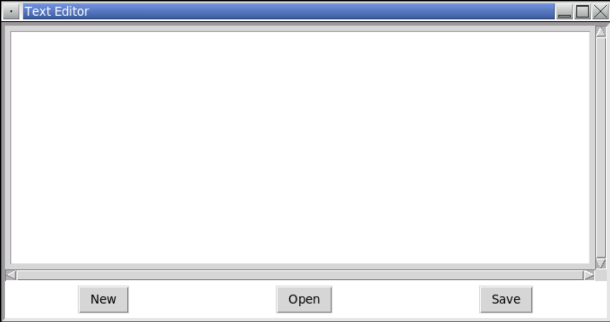
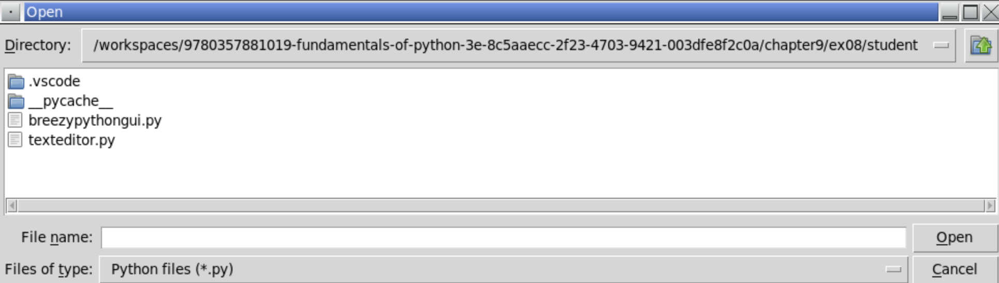
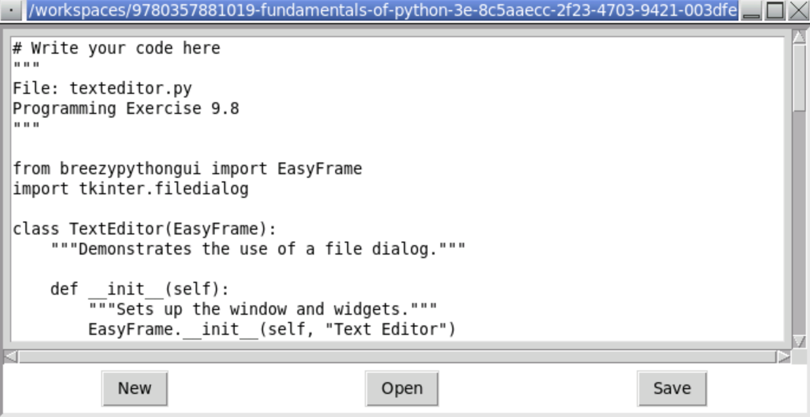
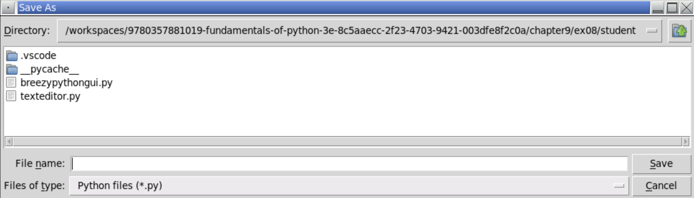

<!-- manual -->

## Instructions

Write a GUI-based program in the file **texteditor.py** that allows the user to open, edit, and save text files. The GUI should include a labeled entry field for the filename and a multiline text widget for the text of the file. The user should be able to scroll through the text by manipulating a vertical scrollbar. Include command buttons labeled Open, Save, and New that allow the user to open, save, and create new files. The New command should then clear the text widget and the entry widget. (LO: 9.2, 9.3, 9.4, 9.6, 9.7)

## Examples of the GUI
#### Example of the intial GUI

    

#### Example of the Open file pane

    

#### Example of the text editor with a file open

    

#### Example of the Save pane

    

## Your Tasks
